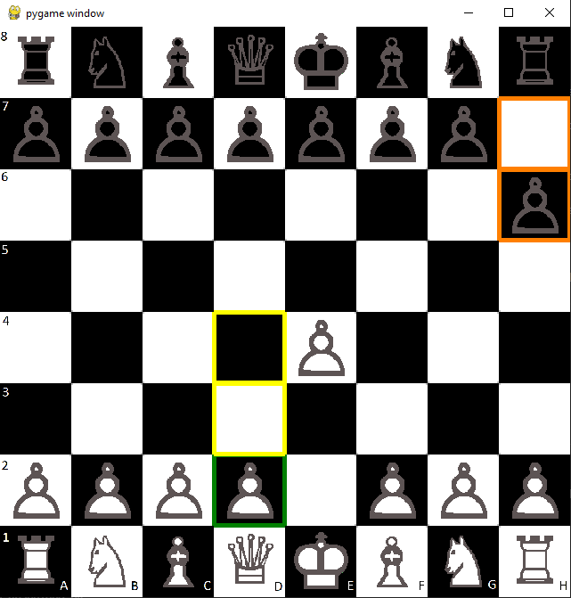

# Chess_game

## Description
This is *a chess game*

## Equipe
* GESMIER Guillaume : délégué ; s'occupe de la partie graphique du jeu sur pygame
* ISSAOUI Safae : s'occupe du plateau de jeu et des mouvements possibles des pièces
* KOPP Bilal : s'occupe du plateau de jeu et des mouvements possibles des pièces
* MULLER Thibault : s'occupe des pièces de jeu et des tests
* VACHEROT Oscar : s'occupe des pièces de jeu

## Commentaires
* Le dossier Classes contient les classes des différentes pièces.

* Le dossier interface contient les fichiers et fonctions utiles à l'interface graphique du jeu.

* Le dossier Jeu contient les fonctions utiles au jeu général : Chess.py contient les fonctions de fin du jeu et les fonctions pour le MVP ; Move.py contient les fonctions utiles aux déplacements des pièces.

* Le dossier Tests contient les tests des modules ; Le fichier qui exécute tous ces tests est en dehors et s'appelle Test.py.

* Jeu_python.py est le jeu général, sans interface graphique, mais dans le terminal. C'est LE fichier à exécuter pour lancer le MVP.

* Jeu.py est le jeu général, sur interface graphique. C'est LE fichier à exécuter pour lancer le jeu.

* Notre jeu peut aussi faire jouer un ordi !

